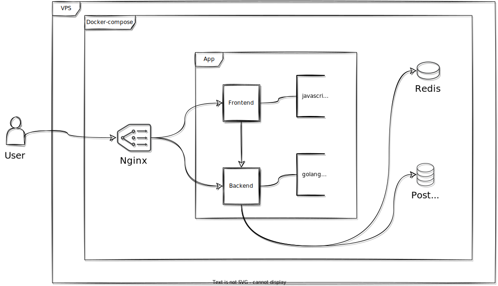

<div align="center" markdown="1">

# [`app-web-tianyi`][url-repo]

[![License][badge-license]][url-license]
[![Status][badge-status-abandoned]][url-repo]
[![Version][badge-version]][url-version]
[![Release][badge-workflow-release]][url-workflow-release]

CI SPA

</div>

## About The Project

CI app

## Features

- Pointless, there are many great tools available
- Backend: Golang, Gorm, Fiber, Postgresql
- Frontend: VueJS with PrimeVue

### Architecture diagram



### Demo

[url-demo]

### Code structure

Clean architecture


```
tianyi
├── api [Interface Adapters]
│   ├── controller
│   ├── middleware
│   └── presenter
├── cmd (CLI interface)
├── docs (OpenAPI Specification and other documentation)
│   └── diagrams
├── entity [Enterprise Business Rules]
├── infrastructure [Frameworks and Drivers]
│   ├── access
│   ├── branch
│   ├── config
│   ├── job
│   ├── jwt
│   ├── lifecycle
│   ├── pipeline
│   ├── pool
│   ├── project
│   ├── schedule
│   ├── session
│   └── user
├── pkg (Support packages)
│   └── error
└── usecase [Application Business Rules]
│   ├── access
│   ├── branch
│   ├── job
│   ├── jwt
│   ├── lifecycle
│   ├── pipeline
│   ├── pool
│   ├── project
│   ├── schedule
│   ├── session
│   └── user
└── web (Web interface)
```


## Resources

- architecture

  - https://gitlab.com/redhatdemocentral/portfolio-architecture-examples
    https://redhatdemocentral.gitlab.io/portfolio-architecture-tooling/index.html?#/portfolio-architecture-examples/projects/retail-data-framework.drawio
  - https://medium.com/wesionary-team/a-clean-architecture-for-web-application-in-go-lang-4b802dd130bb
  - https://8thlight.com/blog/uncle-bob/2012/08/13/the-clean-architecture.html
  - https://eltonminetto.dev/en/post/2020-07-06-clean-architecture-2years-later/
  - https://manakuro.medium.com/clean-architecture-with-go-bce409427d31
  - https://github.com/eminetto/clean-architecture-go
  - https://eltonminetto.dev/en/post/2018-03-05-clean-architecture-using-go/
  - https://blog.cleancoder.com/uncle-bob/2012/08/13/the-clean-architecture.html
  - https://proandroiddev.com/why-you-need-use-cases-interactors-142e8a6fe576
  - https://itnext.io/golang-and-clean-architecture-19ae9aae5683
  - https://hackernoon.com/golang-clean-archithecture-efd6d7c43047

- golang

  - https://www.rudderstack.com/blog/implementing-graceful-shutdown-in-go
  - https://github.com/gofiber/recipes
  - https://ldej.nl/post/generating-swagger-docs-from-go/
  - https://github.com/hashicorp/hcl
  - https://github.com/gothinkster/golang-gin-realworld-example-app
  - https://github.com/alpody/golang-fiber-realworld-example-app
  - https://dev.to/aryaprakasa/serving-single-page-application-in-a-single-binary-file-with-go-12ij
  - https://codesahara.com/blog/golang-job-queue-with-redis-streams/
  - https://gorm.io/
  - https://docs.gofiber.io/
  - https://github.com/thomasvvugt/fiber-boilerplate
  - https://github.com/ansible-semaphore/semaphore
  - https://github.com/spf13/cobra
  - https://github.com/spf13/viper

- security

  - https://cheatsheetseries.owasp.org/cheatsheets/
  - https://www.alexedwards.net/blog/how-to-hash-and-verify-passwords-with-argon2-in-go

- frontend

  - https://github.com/primefaces/sakai-vue
  - https://github.com/primefaces/primevue

<!-- relative links -->

<!-- project links -->

[url-repo]: https://github.com/shishifubing/app-web-tianyi
[url-license]: https://github.com/shishifubing/app-web-tianyi/blob/main/LICENSE
[url-workflow-release]: https://github.com/shishifubing/app-web-tianyi/actions/workflows/release.yml
[url-version]: https://github.com/shishifubing/app-web-tianyi/releases/latest

<!-- external links -->

[url-demo]: https://user-images.githubusercontent.com/97828377/225002074-5fe873ae-0a99-4eb1-850e-23e30a921d1f.webm

<!-- badge links -->

[badge-license]: https://img.shields.io/github/license/shishifubing/app-web-tianyi.svg
[badge-status-abandoned]: https://img.shields.io/badge/status-abandoned-red
[badge-workflow-release]: https://img.shields.io/github/actions/workflow/status/shishifubing/app-web-tianyi/release.yml?branch=main&label=release&logo=github
[badge-version]: https://img.shields.io/github/v/release/shishifubing/app-web-tianyi?label=version

<!-- other badge links -->
